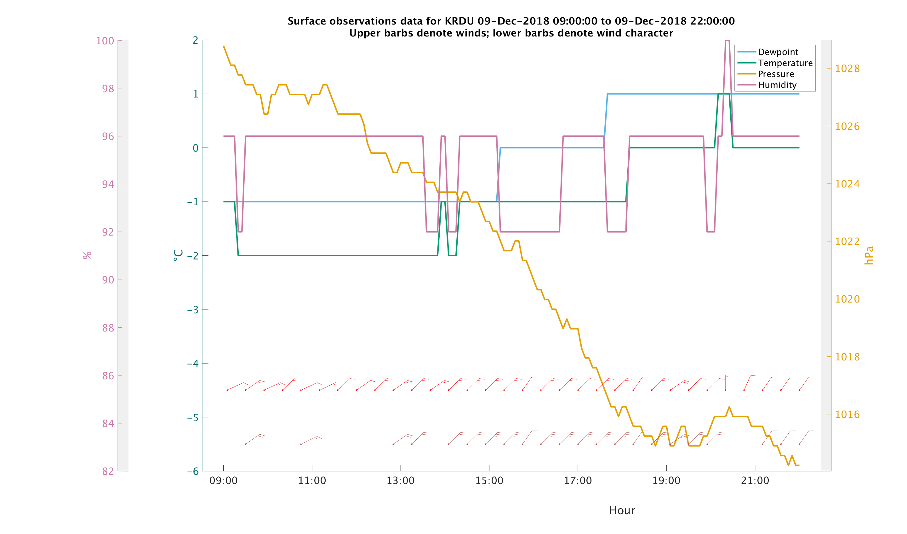
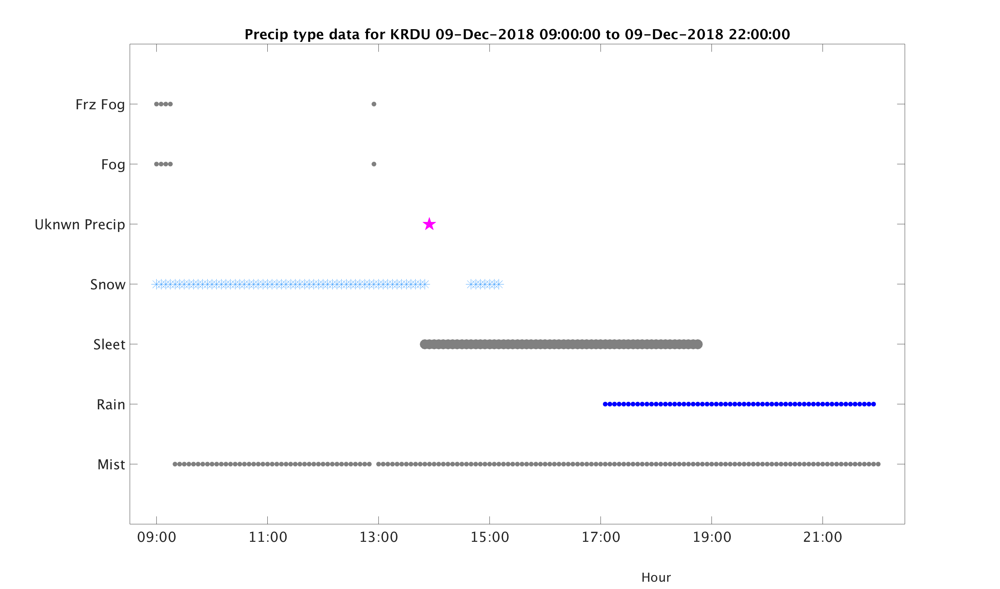
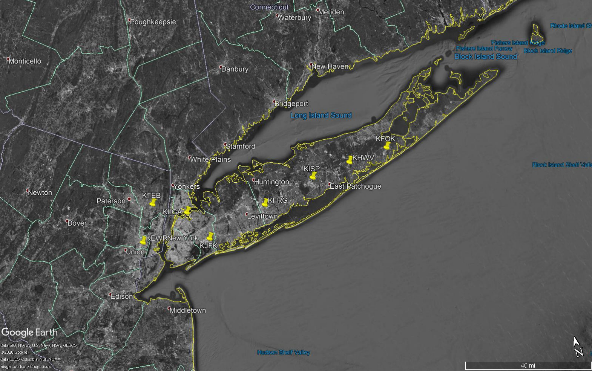
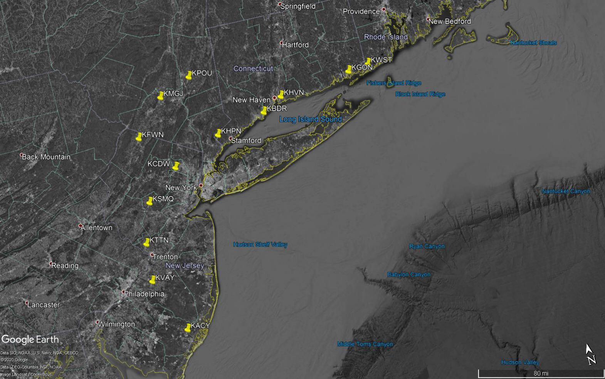

# ASOS Tools
 Code for processing, visualizing, and analyzing 5-minute Automated Surface Observations System (ASOS) data.
 
 ## Table of Contents
* [**Workflow**](https://github.com/dmhuehol/ASOS-Tools#Workflow)  
* [**Example images**](https://github.com/dmhuehol/ASOS-Tools#example-images)  
    * [Code to replicate example images](https://github.com/dmhuehol/ASOS-Tools#code-to-replicate-example-images) 
* [**Searching for weather codes**](https://github.com/dmhuehol/ASOS-Tools#searching-for-weather-codes)
* [**Finding ASOS stations**](https://github.com/dmhuehol/ASOS-Tools#finding-asos-stations)  
    * [List of common ASOS stations](https://github.com/dmhuehol/ASOS-Tools#list-of-common-asos-stations)  
        * [Long Island area](https://github.com/dmhuehol/ASOS-Tools#long-island-area)  
        * [Northeast US](https://github.com/dmhuehol/ASOS-Tools#northeast-us)  
        * [Selected co-located ASOS and radiosonde launch sites](https://github.com/dmhuehol/ASOS-Tools#selected-co-located-asos-and-radiosonde-launch-sites)  
        * [Front Range](https://github.com/dmhuehol/ASOS-Tools#front-range)  
        * [Utah](https://github.com/dmhuehol/ASOS-Tools#utah)        
* [**ASOS documentation**](https://github.com/dmhuehol/ASOS-Tools#asos-documentation)  
* [**Problems**](https://github.com/dmhuehol/ASOS-Tools#resolving-problems)
    * [I downloaded data, then cleared my workspace/closed MATLAB and lost all the filenames!](https://github.com/dmhuehol/ASOS-Tools#i-downloaded-data-then-cleared-my-workspaceclosed-matlab-and-lost-all-the-filenames)  
* [**Sources and Credit**](https://github.com/dmhuehol/ASOS-Tools#sources-and-credit)
 
 ## Workflow
 1. [downloadedFilenames] = **ASOSdownloadFiveMin**(email,site,year,month,path) to download a file from the [NCDC FTP server](https://www.ncdc.noaa.gov/data-access/land-based-station-data/land-based-datasets/automated-surface-observing-system-asos) to the folder given by the path variable. The location of the file(s) downloaded is output as a cell array. This cell array of filenames is also saved to the same directory as the data, so it can be easily accessed after the workspace is cleared without requiring the download command to be rerun.  
 2. [primaryStruct,fullStruct] = **ASOSimportFiveMin**(filepath) imports the file at the location given by the filepath string. Creates two structures: primaryStruct contains only the important fields, while fullStruct contains every field in the file.  
 3. [subsetStruct] = **surfacePlotter**(startDatetime,endDatetime,primaryStruct) plots the data in the structure created in step 2.
 
 ## Example images
 The **surfacePlotter** generates two types of figures. The first, which is always produced, is a timeseries for sea-level pressure, temperature, dewpoint, relative humidity with respect to water, wind, and wind character. The example shown below is drawn from a winter storm in Raleigh, NC on December 9, 2018.  

The second type of figure is an abacus plot that displays precipitation type, as well as the presence of fog and mist. This plot is only generated when precipitation, fog, or mist occurs within the requested timespan. The example below corresponds to the same winter storm as the surface plot.  

### Code to replicate example images
1. [downloadedFilenames] = **ASOSdownloadFiveMin**(emailAddress,'KRDU',2018,12,path)
2. [krdu_1218,~] = **ASOSimportFiveMin**(downloadedFilenames{1})
3. startDatetime = **datetime**(2018,12,9,0,0); endDatetime = **datetime**(2018,12,21,0,0);
3. [winterStormEx] = **surfacePlotter**(startDatetime,endDatetime,krdu_1218)

## Searching for weather codes
A month of ASOS data usually contains 8000-9000 observations. It's often useful to be able to search these structures for a given weather code. **weatherCodeSearch** outputs a list of times corresponding to all observations of a given weather code. For example, to locate all times where ice pellets were detected in the krdu_1218 structure from the example above, use the following command:  
[dates,exactTimes,exactDatenums] = **weatherCodeSearch**('PL',krdu_1218)  
**dates** contains strings of all the days where the input codes occurred  
**exactTimes** stores the exact dates and times of all observations as datestrings  
**exactDatenums** stores the exact dates and times of all observations as datenums  
 
 # Finding ASOS Stations
 There are many, many ASOS stations around the US, and finding the best one(s) for one's purposes can be difficult. The Federal Aviation Administration keeps [a zoomable map](https://www.faa.gov/air_traffic/weather/asos/) of ASOS/AWOS stations by state. Note that only ASOS 5-minute stations, denoted by gray placemarks on this map, are supported by the code in this repository. Some common ASOS stations used by our Environment Analytics group are listed below.
 ### List of Common ASOS Stations
 ----
 #### Long Island area
KISP: Islip, closest to Stony Brook University  
KHWV: Brookhaven  
KFRG: Farmingdale  
KFOK: Westhampton  
KFJK: JFK airport  
KLGA: La Guardia  
KEWR: Newark  
KTEB: Teterboro 

#### Northeast US
Connecticut: KHVN KBDR KGON  
New Jersey: KVAY KTTN KCDW KSMQ KACY  
New York: KHPN KFWN KPOU KMGJ  
Rhode Island: KWST  

#### Selected co-located ASOS and radiosonde launch sites
KGSO/GSO: Greensboro, NC  
KFFC/FFC: Peachtree City, GA  
KALB/ALB: Albany, NY  
KDET/DTX: Detroit/White Lake, MI  
KCAR/CAR: Caribou, ME  
KHQM/UIL: Quillayute, WA  
KBIS/BIS: Bismarck, ND  
#### Front Range
KAPA: Denver - Centennial, CO  
KDEN: Denver, CO  
KCYS: Cheyenne, WY  
KLAR: Laramie, WY
#### Utah
KLGU: Logan  
KOGD: Ogden  
KSLC: Salt Lake City, closest to Alta  
 
 # ASOS Documentation
 Unfortunately, ASOS documentation is scattered around several places and there is no one true "master" document.  
 [**ASOS User's Guide**](https://www.weather.gov/media/asos/aum-toc.pdf) is the NWS user's guide to understanding the sensors and algorithms behind the ASOS data. However, it does not fully explain the present weather codes.  
 [**NWS Surface Training**](https://web.archive.org/web/20170510212516/https://www.nws.noaa.gov/om/forms/resources/SFCTraining.pdf) is a NWS training guide originally created to help NWS personnel interpret METAR/SPECI weather observations, which are in a similar format to ASOS. This document includes many of the present weather codes found in ASOS, but not all of them.  
 [**Federal Meteorological Handbook**](https://www.ofcm.gov/publications/fmh/FMH1/FMH1.pdf) defines standards for reporting surface conditions, with Table 8-5 including all of the codes used by ASOS. However, as it is designed for meteorological observers, it doesn't discuss any of the science behind the ASOS observation strategies.  
 [**TD-6401**](https://www1.ncdc.noaa.gov/pub/data/documentlibrary/tddoc/td6401.pdf) is the official dataset documentation for the ASOS 5-minute data format. However, the information for the weather codes given here is outdated; the codes described in "weather and obstructions" do not correspond to the codes in actual data.
 
# Resolving problems
### I downloaded data, then cleared my workspace/closed MATLAB and lost all the filenames!
The cell array of filenames that's output to the workspace is saved as a .mat file to the same directory as the ASOS data. Navigate to the directory in MATLAB's file viewer and open it manually, or use the MATLAB **load** function. The filename is saved with the naming convention "downloadedFilenames_requested_yyyymmdd_HHMMSS" where the time of the filename corresponds to the time the save command ran within the function.

## Sources and Credit

Unless otherwise specified, code and documentation, was written and is maintained by Daniel Hueholt under the advisement of Dr. Sandra Yuter at North Carolina State University.  
  
**addaxis** written by [Harry Lee](https://www.mathworks.com/matlabcentral/profile/authors/863384-harry-lee), found on the [MATLAB File Exchange](https://www.mathworks.com/matlabcentral/fileexchange/9016-addaxis).  
Copyright (c) 2016, Harry Lee
All rights reserved.
Redistribution and use in source and binary forms, with or without
modification, are permitted provided that the following conditions are met:
* Redistributions of source code must retain the above copyright notice, this
  list of conditions and the following disclaimer.
* Redistributions in binary form must reproduce the above copyright notice,
  this list of conditions and the following disclaimer in the documentation
  and/or other materials provided with the distribution
THIS SOFTWARE IS PROVIDED BY THE COPYRIGHT HOLDERS AND CONTRIBUTORS "AS IS"
AND ANY EXPRESS OR IMPLIED WARRANTIES, INCLUDING, BUT NOT LIMITED TO, THE
IMPLIED WARRANTIES OF MERCHANTABILITY AND FITNESS FOR A PARTICULAR PURPOSE ARE
DISCLAIMED. IN NO EVENT SHALL THE COPYRIGHT OWNER OR CONTRIBUTORS BE LIABLE
FOR ANY DIRECT, INDIRECT, INCIDENTAL, SPECIAL, EXEMPLARY, OR CONSEQUENTIAL
DAMAGES (INCLUDING, BUT NOT LIMITED TO, PROCUREMENT OF SUBSTITUTE GOODS OR
SERVICES; LOSS OF USE, DATA, OR PROFITS; OR BUSINESS INTERRUPTION) HOWEVER
CAUSED AND ON ANY THEORY OF LIABILITY, WHETHER IN CONTRACT, STRICT LIABILITY,
OR TORT (INCLUDING NEGLIGENCE OR OTHERWISE) ARISING IN ANY WAY OUT OF THE USE
OF THIS SOFTWARE, EVEN IF ADVISED OF THE POSSIBILITY OF SUCH DAMAGE.  

**tlabel** written by [Carlos Adrian Vargas Aguilera](https://www.mathworks.com/matlabcentral/profile/authors/869698-carlos-adrian-vargas-aguilera), found on the [MATLAB File Exchange](https://www.mathworks.com/matlabcentral/fileexchange/19314-tlabel-m-v2-6-1-sep-2009)  
Copyright (c) 2008,2009, Carlos Adrian Vargas Aguilera
All rights reserved.
Redistribution and use in source and binary forms, with or without
modification, are permitted provided that the following conditions are met:
* Redistributions of source code must retain the above copyright notice, this
  list of conditions and the following disclaimer.
* Redistributions in binary form must reproduce the above copyright notice,
  this list of conditions and the following disclaimer in the documentation
  and/or other materials provided with the distribution
THIS SOFTWARE IS PROVIDED BY THE COPYRIGHT HOLDERS AND CONTRIBUTORS "AS IS"
AND ANY EXPRESS OR IMPLIED WARRANTIES, INCLUDING, BUT NOT LIMITED TO, THE
IMPLIED WARRANTIES OF MERCHANTABILITY AND FITNESS FOR A PARTICULAR PURPOSE ARE
DISCLAIMED. IN NO EVENT SHALL THE COPYRIGHT OWNER OR CONTRIBUTORS BE LIABLE
FOR ANY DIRECT, INDIRECT, INCIDENTAL, SPECIAL, EXEMPLARY, OR CONSEQUENTIAL
DAMAGES (INCLUDING, BUT NOT LIMITED TO, PROCUREMENT OF SUBSTITUTE GOODS OR
SERVICES; LOSS OF USE, DATA, OR PROFITS; OR BUSINESS INTERRUPTION) HOWEVER
CAUSED AND ON ANY THEORY OF LIABILITY, WHETHER IN CONTRACT, STRICT LIABILITY,
OR TORT (INCLUDING NEGLIGENCE OR OTHERWISE) ARISING IN ANY WAY OUT OF THE USE
OF THIS SOFTWARE, EVEN IF ADVISED OF THE POSSIBILITY OF SUCH DAMAGE.  

**windbarb** written by [Laura Tomkins](https://github.com/lauratomkins/), found at the following [github link](https://github.com/lauratomkins/SBJ). Used by permission.

The Okabe-Ito colorblind-safe discrete color scale is used for line colors.  
**Okabe, M., and K. Ito. 2008.** “Color Universal Design (CUD): How to Make Figures and Presentations That Are Friendly to Colorblind People.” http://jfly.iam.u-tokyo.ac.jp/color/.
